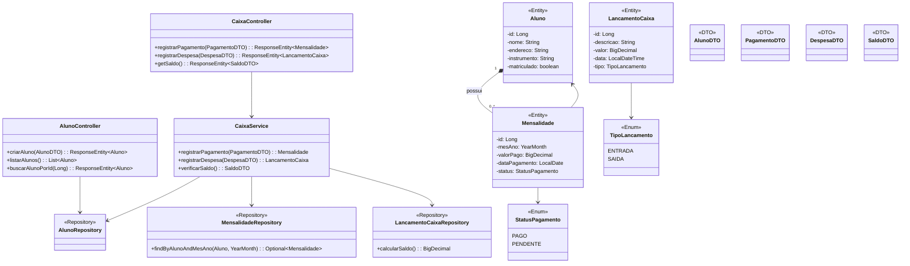

# Sistema de Gestão para Escola de Música

Projeto de uma API REST para gerenciar alunos e o fluxo de caixa de uma pequena escola de música.
Parte da formação no Bootcamp Santander DIO 2025, exercício de Java/Springboot/Design patterns.

🎴


## ⚙ Funcionalidades

* Cadastro e listagem de alunos.
* Registro de pagamento de mensalidades.
* Controle de caixa com registro de entradas (pagamentos) e saídas (despesas).
* Consulta de saldo total do caixa.
* Documentação da API gerada automaticamente com Swagger/OpenAPI.

---

## 🛠️ Tecnologias Utilizadas

* **Java 21**
* **Spring Boot 3**
    * **Spring Web:** Para a construção de APIs REST.
    * **Spring Data JPA:** Para a persistência de dados.
    * **Spring Boot Actuator:** Para endpoints de monitoramento (incluindo shutdown).
* **Hibernate:** Implementação do JPA.
* **H2 Database:** Banco de dados em memória para ambiente de desenvolvimento.
* **Maven:** Gerenciador de dependências e build.
* **Lombok:** Para reduzir código boilerplate em classes de modelo.
* **OpenAPI (Swagger):** Para documentação e teste interativo da API.

---

## 🚀 Como Executar

**Pré-requisitos:**
* JDK 17 ou superior.
* Apache Maven 3.8 ou superior.

1.  **Clone o repositório:**
    ```bash
    git clone [https://seu-repositorio-aqui.git](https://seu-repositorio-aqui.git)
    cd nome-da-pasta-do-projeto
    ```

2.  **Execute a aplicação com o Maven:**
    ```bash
    mvn spring-boot:run
    ```

3.  A aplicação estará disponível em `http://localhost:8080`.

---

## 📖 API Endpoints

Após iniciar a aplicação, você pode acessar a documentação interativa do **Swagger UI** para ver todos os endpoints e testá-los diretamente pelo navegador:

* **Swagger UI:** [http://localhost:8080/swagger-ui.html](http://localhost:8080/swagger-ui.html)
* **Console do H2 Database:** [http://localhost:8080/h2-console](http://localhost:8080/h2-console)
    * **JDBC URL:** `jdbc:h2:mem:testdb`
    * **User Name:** `sa`
    * **Password:** (deixe em branco)

### Principais Endpoints:

#### Alunos
* `POST /api/alunos`: Cria um novo aluno.
* `GET /api/alunos`: Retorna a lista de todos os alunos.
* `GET /api/alunos/{id}`: Busca um aluno específico pelo seu ID.

#### Caixa e Pagamentos
* `POST /api/pagamentos`: Registra o pagamento de uma mensalidade para um aluno.
* `POST /api/caixa/despesas`: Registra uma nova despesa (saída de caixa).
* `GET /api/caixa/saldo`: Retorna o saldo atual do caixa.

